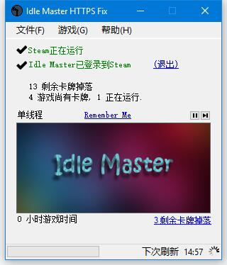

# IdleMaster-HTTPS-Fix
## A HTTPS Fixed Version Of Idle Master  

## About Idle Master HTTPS Fix  
This Project is the HTTPS Fixed version of IdleMaster, From [IdleMaster魔改版](https://github.com/wagayaluda/idle)(It is unusable now).  
Idle Master HTTPS Fixed version has repaired many Bugs Since IdleMaster is deprecated. It should work fine till the last Update.
And It uses completely HTTPS to connect to Steamcommunity, So Chinese User with Hosts modified can use it freely without vpn.

## About Idle Master  
The Original Idle Master is developed by [jshackles](https://github.com/jshackles/idle_master)  
This program will determine which of your Steam games still have Steam Trading Card drops remaining,
and will go through each application to simulate you being “in-game” so that cards will drop. 
It will check periodically to see if the game you’re idling has card drops remaining. 
When only one drop remains, it will start checking more frequently. 
When the game you’re idling has no more cards, it’ll move on to the next game. 
When no more cards are available, the program will terminate.  
**The Original IdleMaster project has been discontinued**, no further bug fixes or changes will be made.

## Credits  
Idle Master was created by jshackles, based on the original code created by Stumpokapow.  
Idle Master was writen in C# using Steamworks.NET and CSteamworks by Riley Labrecque (https://github.com/rlabrecque/CSteamworks), and using open source icons from Open Iconic (https://github.com/iconic/open-iconic).  
IdleMaster 魔改版 was modified by 哇嘎吖噜哒, based on the original Idle Master.  
IdleMaster HTTPS Fix was modified by JackMyth, based on IdleMaster 魔改版.

License
-------

This program is free software: you can redistribute it and/or modify it under the terms of the GNU General Public License as published by the Free Software Foundation.  A copy of the GNU General Public License can be found at http://www.gnu.org/licenses/.  For your convenience, a copy of this license is included.
